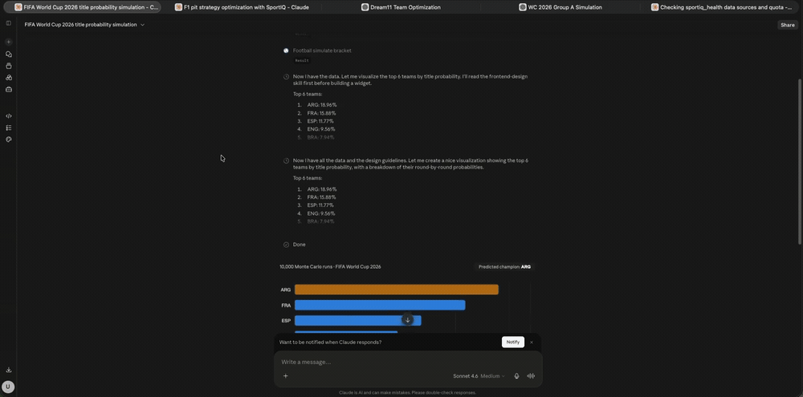

# sportiq-mcp

<!-- mcp-name: io.github.Ninjabeam20/sportiq-mcp -->

[](https://github.com/Ninjabeam20/SportIQ-MCP/actions/workflows/test.yml)
[](https://pypi.org/project/sportiq-mcp/)
[](https://pypi.org/project/sportiq-mcp/)
[](LICENSE)
[](https://registry.modelcontextprotocol.io)

MCP server that turns any AI assistant into a sports analyst across **FIFA World Cup 2026 football, Formula 1, and IPL cricket** — 44 AI-callable tools.



*SportIQ running live in Claude — Monte Carlo World Cup bracket, F1 pit strategy, and Dream11 optimisation, each a visible MCP tool call. ([1-min demo](docs/assets/SportIQ.mp4))*

<p align="center">
  <a href="https://github.com/sponsors/Ninjabeam20"></a>
  &nbsp;
  <a href="https://sport-iq-sports-analysis.vercel.app"></a>
</p>

> **Every tool is free** — the three flagships and everything in the INTEL columns below, no key, no account. If SportIQ is useful to you, [sponsor the project](https://github.com/sponsors/Ninjabeam20) to support ongoing development. It's a donation, not a paywall — nothing is locked behind it.

## What it does

Raw-data tools are table stakes; the intelligence layer is the product. Three flagships:

- **`football_simulate_bracket`** — Monte Carlo with Poisson xG over the 48-team WC 2026 format → per-team round + title probabilities.
- **`f1_predict_pit_strategy`** — tyre-degradation model on OpenF1 telemetry → optimal stop laps + compound sequence.
- **`cricket_build_dream11_team`** — PuLP constraint solver → a valid fantasy XI under credit/role/team caps.

### Tools (44 total)

| Sport | RAW data | INTEL |
|-------|----------|-------|
| **Football** (WC 2026) | groups, fixtures, standings, squad, match stats, top scorers, odds | xg_model, match_predictor, simulate_group, **simulate_bracket**, knockout_path, form_trends, find_value_bets, build_accumulator |
| **F1** | sessions, drivers, lap_times, standings, race_results, weather | tyre_degradation, undercut_window, head_to_head_pace, weather_strategy_impact, qualifying_analysis, race_pace_compare, **predict_pit_strategy** |
| **Cricket** (IPL) | live_matches, scorecard, points_table, schedule, squad, live_odds | **build_dream11_team**, captain_recommendation, differential_picks, player_form_index, pitch_report, head_to_head, player_matchup, find_value_bets |
| **Cross-sport** | — | build_accumulator |

Plus `sportiq_health` (cache backend + per-adapter status and remaining API quota).

**Data sources** (per chain, with keyless fallbacks): football → [API-Football](https://www.api-football.com) → [football-data.org](https://football-data.org) → bundled `wc2026.json`. F1 → [OpenF1](https://openf1.org) → [Jolpica](https://jolpi.ca) → `fastf1`. Cricket → CricAPI + static seeds (NDTV/Cricbuzz scrapers opt-in).

## Where it works

Anywhere that speaks MCP — Claude (Desktop + web), ChatGPT, Cursor, and any MCP client. Two ways to run it:

- **Hosted (no install):** add a custom connector — works in claude.ai web & ChatGPT.
- **Local (`uvx`/Desktop config/IDEs):** install from PyPI.

## How it works

### Hosted — no install

A public instance runs on Google Cloud Run. Add this as a custom connector with **No authentication**:

```
https://sportiq-mcp-329580761892.us-central1.run.app/mcp
```

- **claude.ai (web):** Settings → Connectors → Add custom connector → paste URL → Save.
- **ChatGPT:** Settings → Apps & Connectors → enable **Developer mode** → Create app (MCP) → paste URL → No authentication → Connect.

All 44 tools work out of the box on the plain URL above — data tools *and* the full intelligence layer (bracket simulation, pit strategy, Dream11, value bets). No key, no account, nothing to unlock.

> First request after idle takes ~5–10s (the server scales to zero, so it wakes up); fast after that.

### Local install

```bash
uvx sportiq-mcp                       # from PyPI
# or from source:
git clone https://github.com/Ninjabeam20/SportIQ-MCP && cd sportiq-mcp
uv sync && uv run python -m sportiq.server
```

**Claude Desktop config:**

```json
{
  "mcpServers": {
    "sportiq": {
      "command": "uvx",
      "args": ["sportiq-mcp"],
      "env": {
        "CRICAPI_KEY": "your_cricapi_key",
        "APIFOOTBALL_KEY": "your_apifootball_key",
        "THEODDS_KEY": "your_theodds_key"
      }
    }
  }
}
```

Every tool works with no keys — the server boots and serves seed/free-source data, and the whole intelligence layer runs locally. Data-source keys are optional and only upgrade the *source* a tool reads from (fresher/live data); they never unlock tools.

| Var | Unlocks | Free tier |
|-----|---------|-----------|
| `APIFOOTBALL_KEY` | Live football fixtures / standings / squads / scorers | 100 req/day |
| `THEODDS_KEY` | Market odds (football + cricket probability tools) | 500 req/month |
| `FOOTBALLDATA_KEY` | football-data.org fallback (token optional) | 10 req/min |
| `CRICAPI_KEY` | Live cricket scores / scorecards / schedules / squads | 100 req/day |
| `RAPIDAPI_KEY` | Paid Cricbuzz fallback (player career stats) | plan-dependent |
| `SPORTIQ_ENABLE_NDTV` / `SPORTIQ_ENABLE_CRICBUZZ` | Opt-in cricket scrapers (off by default — ToS) | — |
| `REDIS_URL` | Shared cache backend (defaults to local diskcache) | — |
| `SPORTIQ_TRANSPORT` | `stdio` (default, local) or `http` (remote/Cloud Run) | — |

> macOS arm64: the Dream11 solver needs CBC — `brew install cbc` (the binary bundled with PuLP is x86-only).

### Self-host

Set `SPORTIQ_TRANSPORT=http` and the server serves the MCP endpoint at `/mcp` (binds `0.0.0.0:$PORT`). A ready-to-build `Dockerfile` is included; see **[`cloud.md`](cloud.md)** for a Google Cloud Run deploy (free tier). With your own keys set, the live-score and odds tools come online too.

## Support SportIQ

Every tool is free and open source — the raw-data tools, `sportiq_health`, and the full intelligence layer (the three flagships + everything in the INTEL columns). No key, no account, nothing gated.

If SportIQ saves you time, **[sponsor the project at github.com/sponsors/Ninjabeam20](https://github.com/sponsors/Ninjabeam20)** to help fund hosting and ongoing development. It's a voluntary donation — you get the same fully-unlocked server either way.

## Is it safe?

- **Open source, MIT licensed**, published on [PyPI](https://pypi.org/project/sportiq-mcp/) with signed build attestations — read the code before you connect it.
- **Read-only.** Tools only fetch and analyse public sports data — no write, delete, payment, email, or file-system tools.
- **No data collection.** It answers a tool call and forgets it.
- **The hosted instance holds no secrets** — it runs with zero API keys.
- Independently reviewed by AI code-audit agents (verdict: ship-ready, clean) — see [`SECURITY.md`](SECURITY.md#independent-review) for the full trust model.

Every response carries a `meta.is_stale` flag + data age, so the AI tells you how fresh each answer is. Live scores refresh ~30s, F1 telemetry ~10s, standings ~10min, fixtures ~6h.

## Develop

```bash
uv sync --extra dev
uv run pytest
uv run ruff check .
npx @modelcontextprotocol/inspector uv run python -m sportiq.server
```

See `CLAUDE.md` for collaboration rules and `docs/index.md` for the wiki entry point.

## Data sources & credits

SportIQ derives some model constants offline from open datasets. Raw datasets are never shipped or fetched at runtime — only small derived seeds (`circuits.json`, `venues.json`, `elo_seed.json`) are committed.

- **[F1DB](https://github.com/f1db/f1db)** (CC BY 4.0) — per-circuit stop counts + lap lengths; pit **loss** measured offline from OpenF1 laps.
- **[Cricsheet](https://cricsheet.org)** — ball-by-ball IPL data → derived venue scoring priors (`venues.json`).
- **[martj42 international football results](https://github.com/martj42/international_results)** (CC0) — Elo backtesting.
- **[OpenF1](https://openf1.org)** — keyless live F1 telemetry (runtime source).
- **[football-data.org](https://football-data.org)** — free football data (runtime source).

## License & author

Created and maintained by **Utkarsh Gupta** ([@Ninjabeam20](https://github.com/Ninjabeam20)). Licensed under the [MIT License](LICENSE) — © 2026 Utkarsh Gupta. Canonical package: [`sportiq-mcp` on PyPI](https://pypi.org/project/sportiq-mcp/) / `io.github.Ninjabeam20/sportiq-mcp` in the [official MCP registry](https://registry.modelcontextprotocol.io).
